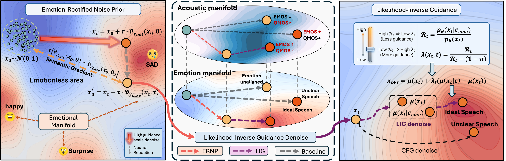

# 🎭 Rectifying the Emotional Flow

<p align="center">
  
  
  
  
  
  
</p>

## 📝 Abstract

While diffusion and flow-matching models have advanced TTS, generating high-arousal emotions remains a persistent challenge due to the trade-off between stability and expressiveness. Existing systems often suffer from linguistic collapse when pursuing high intensity or fail to meet target emotional levels under stable settings. In this work, we identify that standard Gaussian initialization inevitably introduces a neutral prosody bias, while uniform Classifier-Free Guidance often distorts the acoustic manifold, leading to artifacts. To address this, we propose an inference framework that rectifies the emotional trajectory. An **Emotion-Rectified Noise Prior** injects a semantic gradient at initialization to align sampling with the target emotional manifold, and **Likelihood-Inverse Guidance** adaptively schedules guidance via a conditional/unconditional likelihood ratio, strengthening guidance only when the trajectory drifts toward a neutral fallback. Extensive experiments demonstrate that our method effectively resolves the stability bottleneck in high-intensity scenarios, achieving superior linguistic accuracy and emotional fidelity without model retraining. 

## 🔥 Highlights

- 🎯 **Zero retraining** — pure inference-time enhancement, works on any Flow-Matching TTS
- 🧭 **ERNP** (Emotion-Rectified Noise Prior) — steers initial noise toward emotional manifold via `lookahead → calibration → re-normalization`
- 📈 **LIG** (Likelihood-Inverse Guidance) — replaces constant CFG with `dynamic λ(t)` derived from recursive likelihood-ratio estimation
- ⚡ **No extra model calls** — LIG reuses existing conditional/unconditional velocity fields
- 🏆 **SOTA results** — WER 4.41% → **2.53%**, EMOS 3.63 → **3.89** on HIED benchmark
- 🔌 **Plug-and-play** — validated on CosyVoice2, IndexTTS2, and F5-TTS architectures

## 🏗️ Method

<p align="center">
  
</p>

Our framework operates entirely at **inference time** with zero retraining, consisting of two complementary components:

### ERNP (Emotion-Rectified Noise Prior)

Rectifies the initial Gaussian noise *before* the ODE solve via a two-step lookahead–calibration cycle:

1. **Lookahead** — forward one step from $x_0$ with high guidance strength $\lambda_{\text{init}}$:  $\quad x_\tau = x_0 + \tau \cdot \tilde{v}_{\lambda_{\text{init}}}(x_0, 0)$
2. **Calibration** — backward one step with base guidance $\lambda_{\text{base}}$:  $\quad x_0^* = x_\tau - \tau \cdot \tilde{v}_{\lambda_{\text{base}}}(x_\tau, \tau)$
3. **Re-normalization** — strictly standardize $x_0^*$ back to $\mathcal{N}(0, I)$

The net effect is a controlled displacement along the **emotional semantic gradient**, steering the starting point toward the target emotional manifold.

### LIG (Likelihood-Inverse Guidance)

Replaces constant CFG with a **dynamic, trajectory-aware** guidance schedule. We model the learned conditional distribution as an additive mixture of neutral and emotional components, and derive the per-step guidance strength:

$$\lambda(x_t, t) = \frac{R_t}{R_t - (1-\pi)}$$

where $R_t$ is the **likelihood ratio** estimated recursively from the conditional/unconditional velocity field divergence — no additional model calls required. When the trajectory is already in the emotional region ($R_t \gg 1$), guidance stays minimal; when it drifts toward neutral ($R_t \to 1-\pi$), guidance increases sharply to correct the course.

```
x₀ ~ N(0,I) ──[ERNP]──▶ Rectified x₀* ──[LIG: dynamic λ(t)]──▶ Emotional speech x₁
```

## 📦 Installation

```bash
# Create environment
conda create -n emo-tts python=3.11
conda activate emo-tts
conda install ffmpeg

# Install PyTorch (match your CUDA version)
pip install torch==2.8.0+cu128 torchaudio==2.8.0+cu128 --extra-index-url https://download.pytorch.org/whl/cu128

# Install from source
cd Emo-TTS
pip install -e .
```

## 📁 Code Structure

```
Emo-TTS/
├── src/emo_tts/
│   ├── model/
│   │   ├── cfm.py              # Core: CFM sampling with ERNP + LIG
│   │   ├── backbones/          # DiT, MMDiT, UNet-T
│   │   ├── modules.py          # Mel spectrogram, attention, etc.
│   │   ├── trainer.py          # Training loop
│   │   └── utils.py            # Utilities
│   ├── configs/                # Model architecture YAML configs
│   ├── infer/
│   │   ├── infer_cli.py        # CLI inference
│   │   ├── infer_gradio.py     # Gradio web UI
│   │   └── utils_infer.py      # Inference utilities
│   ├── train/                  # Training & finetuning scripts
│   ├── eval/                   # Evaluation tools (WER, SIM, UTMOS)
│   └── runtime/                # Triton + TensorRT-LLM deployment
├── method.png
├── pyproject.toml
└── README.md
```

> **Key file:** `src/emo_tts/model/cfm.py` — the `CFM.sample()` method integrates both ERNP (noise rectification before ODE) and LIG (dynamic guidance inside ODE).

## 🚀 Inference

```bash
# CLI inference
emo-tts_infer-cli --model EmoTTS_v1_Base \
  --ref_audio "path/to/reference.wav" \
  --ref_text "Transcription of the reference audio." \
  --gen_text "Text you want to synthesize."

```

## 📜 License

Code is released under the [MIT License](LICENSE).
